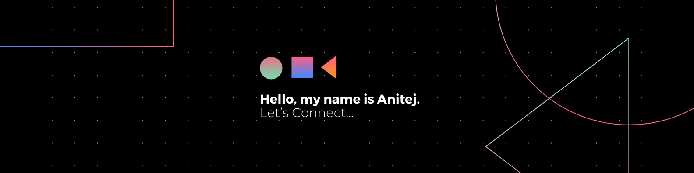

<!-- Banner Image -->

  

<h1 align="left">Hello 👋, I'm Anitej C. Sood 🥷</h1>

## About Me
High-achieving student with a passion for computers, always willing to learn and grow. Open for opportunities to develop experience and learn new things. I believe the secret of getting ahead is getting started.

Curious, Optimistic, Indefatigable.

📫 **Reach me at:** anitejcsood@gmail.com

---

## Connect with Me

  

---

## Languages and Tools

  
  
  
  
  
  
  
  
  
  
  

---

## 📊 GitHub Stats

  
  &nbsp;
  
  &nbsp;
  

